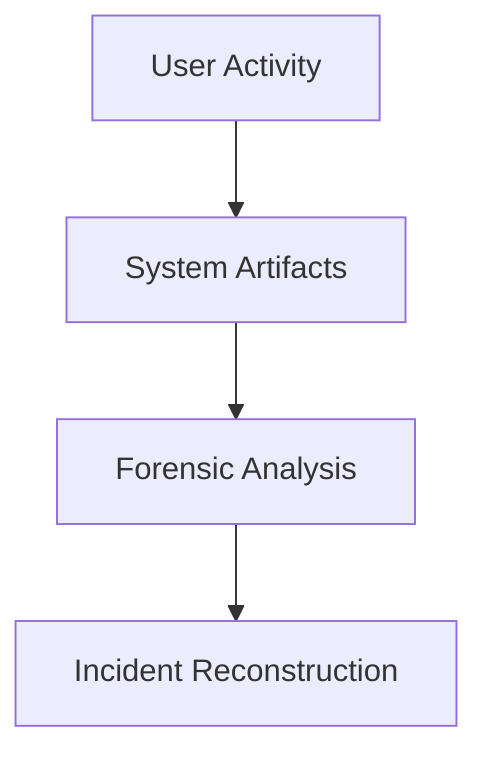
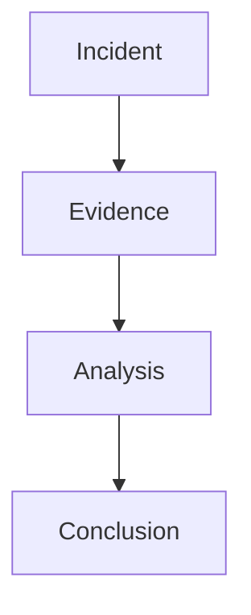
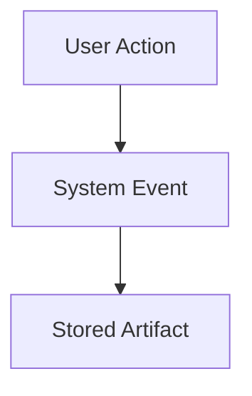
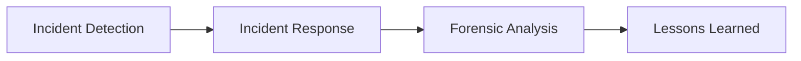
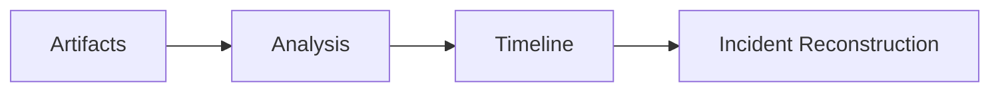

# Digital Forensics

---

## What is Digital Forensics?

Digital forensics is the process of:

<v-click>

1. Collecting evidence  

</v-click>

<v-click>

2. Preserving evidence  

</v-click>

<v-click>

3. Analyzing artifacts  

</v-click>

<v-click>

4. Presenting findings  

</v-click>

The goal is to reconstruct **what actually happened on a system**.

---

## Questions Forensics Can Answer

Investigators try to answer questions such as:

<v-click>

- What happened?

</v-click>

<v-click>

- When did it happen?

</v-click>

<v-click>

- How did it happen?

</v-click>

<v-click>

- Who was involved?

</v-click>

<v-click>

- What data was affected?

</v-click>

---

## Digital Evidence is Everywhere

Modern systems constantly generate traces.

Examples include:

- filesystem metadata  
- system logs  
- browser history  
- application data  
- network logs  

These traces become **forensic artifacts**.

---

## Example Incident

Imagine the following situation:

<v-click>

- A company reports suspicious activity

</v-click>

<v-click>

- Files suddenly disappear

</v-click>

<v-click>

- Unusual network traffic appears

</v-click>

Investigators must determine:

<v-click>

- what happened

</v-click>

<v-click>

- how the attacker entered

</v-click>

<v-click>

- what data was accessed

</v-click>

Digital forensics helps answer these questions.

---

## Real-World Use Cases

Digital forensics is used in many investigations:

- malware investigations  
- data breaches  
- insider threats  
- fraud investigations  

- corporate investigations  
- law enforcement  
- incident response  
- threat hunting  

---

## Digital Forensics vs Incident Response

### Incident Response

- detect attacks  
- contain threats  
- restore systems  

### Digital Forensics

- analyze evidence  
- reconstruct events  
- support investigations  

---

## Skills Used in Digital Forensics

Digital forensics combines several disciplines:

- technical knowledge  
- analytical thinking  
- attention to detail  
- investigative methodology  

It is both **technical analysis and investigative work**.

---

## What You Will Learn

In this workshop we will explore:

<v-click>

1. Disk acquisition  

</v-click>

<v-click>

2. Filesystem structures  

</v-click>

<v-click>

3. Forensic artifacts  

</v-click>

<v-click>

4. File recovery  

</v-click>

<v-click>

5. Timeline reconstruction  

</v-click>

These concepts form the foundation of forensic analysis.

---

## From Evidence to Story

Digital forensics turns raw technical data into a narrative explaining what happened.
