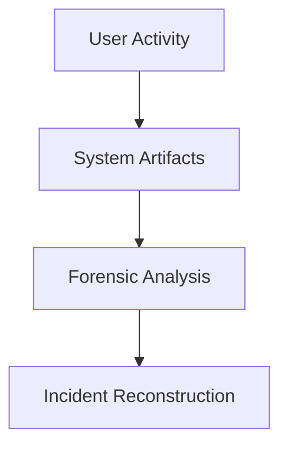
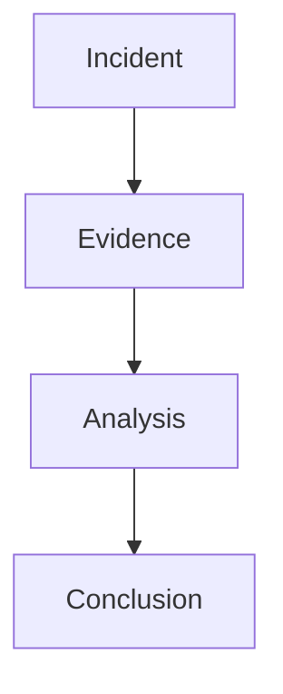
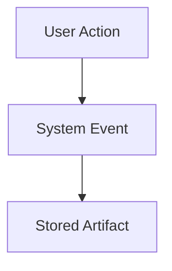
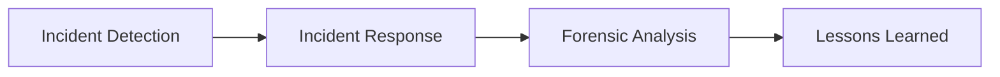

# Digital Forensics

---

## What is Digital Forensics?

Digital forensics is the process of:

1. Collecting evidence  
2. Preserving evidence  
3. Analyzing artifacts  
4. Presenting findings  

The goal is to reconstruct **what actually happened on a system**.

---

## Questions Forensics Can Answer

Investigators try to answer questions such as:

- What happened?
- When did it happen?
- How did it happen?
- Who was involved?
- What data was affected?

---

## Digital Evidence is Everywhere

Modern systems constantly generate traces.

Examples include:

- filesystem metadata  
- system logs  
- browser history  
- application data  
- network logs  

These traces become **forensic artifacts**.

---

## Example Incident

Imagine the following situation:

- A company reports suspicious activity
- Files suddenly disappear
- Unusual network traffic appears

Investigators must determine:

- what happened
- how the attacker entered
- what data was accessed

Digital forensics helps answer these questions.

---

## Real-World Use Cases

- malware investigations  
- data breaches  
- insider threats  
- fraud investigations  

- corporate investigations  
- law enforcement  
- incident response  
- threat hunting  

---

## Digital Forensics vs Incident Response

### Incident Response

- detect attacks  
- contain threats  
- restore systems  

### Digital Forensics

- analyze evidence  
- reconstruct events  
- support investigations  

---

## Skills Used in Digital Forensics

Digital forensics combines several disciplines:

- technical knowledge  
- analytical thinking  
- attention to detail  
- investigative methodology  

It is both **technical analysis and investigative work**.

---

## What You Will Learn

In this workshop we will explore:

1. Disk acquisition  
2. Filesystem structures  
3. Forensic artifacts  
4. File recovery  
5. Timeline reconstruction  

These concepts form the foundation of forensic analysis.

---

## From Evidence to Story

Digital forensics turns raw technical data into a narrative explaining what happened.
