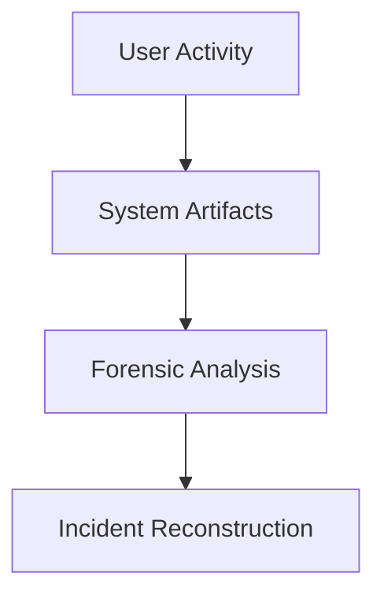
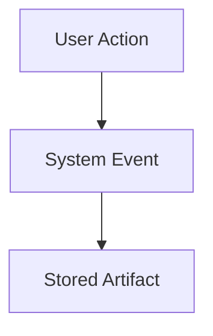

# Digital Forensics

---

---
layout: two-cols
---

## What is Digital Forensics?

Digital forensics is the process of:

1. Collecting evidence  
2. Preserving evidence  
3. Analyzing artifacts  
4. Presenting findings  

The goal is to reconstruct **what actually happened on a system**.

::right::

---

## Questions Forensics Can Answer

Digital investigations try to answer questions such as:

- What happened?
- When did it happen?
- How did it happen?
- Who was involved?
- What data was affected?

These questions guide forensic investigations.

---

---
layout: two-cols
---

## Digital Evidence is Everywhere

Modern systems constantly generate traces.

Examples include:

- filesystems
- system logs
- browser history
- application data
- network logs

These traces become **forensic artifacts**.

::right::

---

## Example Incident

Imagine the following situation:

- A company reports suspicious activity
- Files suddenly disappear
- Unusual network traffic appears

Investigators must determine:

- what happened
- how the attacker entered
- what data was accessed

Digital forensics provides the answers.

---

## Real-World Use Cases

Digital forensics is used in many investigations:

- malware incidents
- data breaches
- insider threats
- fraud investigations

Organizations rely on forensic analysis to understand security incidents.

---

---
layout: two-cols
---

## Digital Forensics vs Incident Response

Both disciplines work closely together.

### Incident Response

- detect attacks
- contain threats
- restore systems

### Digital Forensics

- analyze evidence
- reconstruct events
- support investigations

::right::

---

## Why Learn Digital Forensics?

Digital forensics helps security professionals:

- understand attacker behavior
- investigate incidents
- recover evidence
- improve defenses

It transforms **technical traces into investigative insight**.

---

## Skills Used in Forensics

Digital forensics combines several disciplines:

- technical knowledge
- analytical thinking
- attention to detail
- investigative methodology

It is both **technical analysis and investigative work**.

---

## What You Will Learn

In this workshop we will explore:

1. Disk acquisition  
2. Filesystem structures  
3. Forensic artifacts  
4. File recovery  
5. Timeline reconstruction  

These concepts form the foundation of forensic analysis.

---

## From Evidence to Story

Digital forensics turns raw data into an explanation of events.

---

## Next Step

Next we will examine:

**How forensic disk images are created.**

Disk acquisition is the first step in any forensic investigation.
