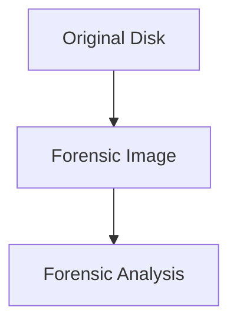
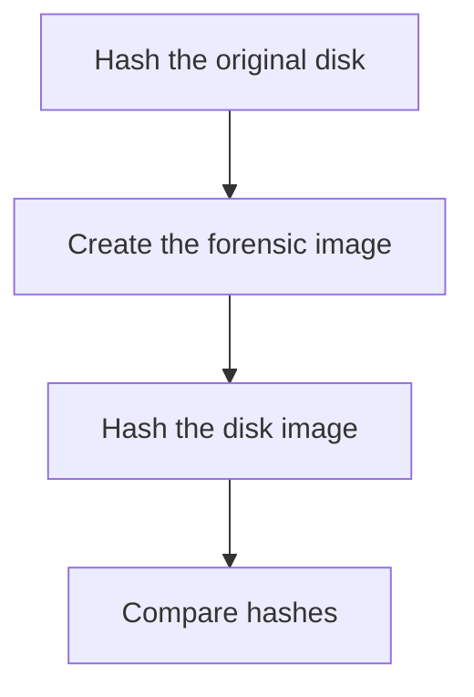

# Disk Acquisition

---

## What is Disk Acquisition

Disk acquisition is the process of creating a **forensic copy of storage media**.

The goal is to preserve digital evidence while allowing analysis on a duplicate.

Key principle:

> Never analyze the original evidence.

Investigators work on a copy of the data.

---

## Why Imaging is Necessary

Direct analysis of the original disk can:

- modify timestamps
- alter filesystem metadata
- destroy evidence

Forensic imaging prevents these risks.

---

## Types of Acquisition

### Dead acquisition

- system powered off
- disk removed
- image created from storage media

### Live acquisition

- system running
- image collected from active system

Dead acquisition is preferred whenever possible.

---

## Disk Imaging Concept

<div style="display:flex;gap:2rem;align-items:flex-start;margin-top:1rem">

<div style="flex:3">

The forensic image contains an **exact sector-by-sector copy** of the disk.

</div>

<div style="flex:2">



</div>

</div>

---

## Disk Image Formats

Common forensic image formats:

- RAW (`.img`)
- E01 (EnCase format)
- AFF (Advanced Forensic Format)

RAW images are simple sector-by-sector copies.

---

## Write Blockers

Write blockers prevent modification of the original disk.

Types:

- hardware write blockers
- software write blockers

Example hardware devices:

- Tableau write blocker
- WiebeTech write blocker

These ensure evidence integrity.

---

## Imaging with dd

The `dd` utility performs a raw disk copying.

<div style="display:flex;gap:2rem;align-items:flex-start;margin-top:1rem">

<div style="flex:3">

Parameters:

- `if` → input file (source disk)
- `of` → output file (image file)
- `bs` → block size

</div>

<div style="flex:2">

```
dd if=/dev/sda of=disk.img bs=4M status=progress
```

</div>

</div>

---

## dd with Error Handling

Example forensic imaging command with error handling:

<div style="display:flex;gap:2rem;align-items:flex-start;margin-top:1rem">

<div style="flex:3">

Options:

- `noerror` → continue on read errors
- `sync` → pad missing blocks

Useful for damaged disks.

</div>

<div style="flex:2">

```
dd if=/dev/sda of=evidence.img bs=4M conv=noerror,sync
```

</div>

</div>

---

## dc3dd

`dc3dd` is an enhanced forensic version of `dd`.

<div style="display:flex;gap:2rem;align-items:flex-start;margin-top:1rem">

<div style="flex:3">

Features:

- hash calculation
- error handling
- progress reporting

</div>

<div style="flex:2">

```
dc3dd if=/dev/sda of=disk.img hash=sha256 log=acquisition.log
```

</div>

</div>

---

## GUI Imaging Tools

Graphical acquisition tools include:

- Guymager
- FTK Imager
- EnCase Imager

These tools provide:

- hash verification
- evidence metadata
- acquisition logging

---

## Hash Verification

After imaging, investigators verify integrity using hashes.

<div style="display:flex;gap:2rem;align-items:flex-start;margin-top:1rem">

<div style="flex:3">

Hash values confirm the image was not modified.

</div>

<div style="flex:2">

```
sha256sum disk.img
```

```
b1946ac92492d2347c6235b4d2611184  disk.img
```

</div>

</div>

---

## Hash Verification Workflow

<div style="display:flex;gap:2rem;align-items:flex-start;margin-top:1rem">

<div style="flex:3">

Matching hashes confirm image integrity.

</div>

<div style="flex:2">



</div>

</div>

---

## Chain of Custody

Investigators must document evidence handling.

Example information:

- who collected the evidence
- when it was collected
- where it was stored
- who accessed it

Proper documentation ensures legal validity.

---

## Key Takeaways

Important acquisition principles:

- never modify original evidence
- create verified disk images
- use write blockers
- document the acquisition process
