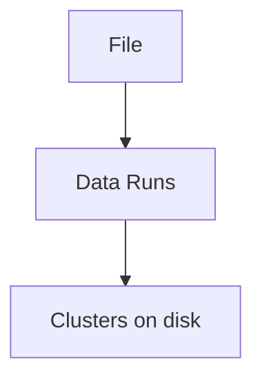

# NTFS Filesystem

---

## What is NTFS?

NTFS stands for **New Technology File System**.

It is the primary filesystem used by modern Windows systems.

NTFS provides many advanced features:

- journaling
- access control lists
- large file support
- extensive metadata storage

These features also make NTFS extremely valuable for forensic investigations.

---

## NTFS Key Concept

The most important NTFS structure is the:

**Master File Table (MFT)**

Every file and directory on an NTFS volume is represented by a record in the MFT.

---

## Master File Table (MFT)

The MFT is essentially a database of all files.

<div style="display:flex;gap:2rem;align-items:flex-start;margin-top:1rem">

<div style="flex:3">

Each file has its own **MFT record**.

Even system files and directories are stored as MFT records.

</div>

<div style="flex:2">

```
+--------------------+
| MFT Record         |
+--------------------+
| File Metadata      |
| File Attributes    |
| File Timestamps    |
| Data Runs          |
+--------------------+
```

</div>

</div>

---

## MFT Record Size

Typical properties:

- default size: **1024 bytes**
- contains file metadata
- contains file attributes
- may contain file data (for small files)

Small files may be stored **directly inside the MFT**.

This is called **resident data**.

---

## NTFS Attributes

NTFS stores information using attributes.

Common attributes include:

- `$STANDARD_INFORMATION`
- `$FILE_NAME`
- `$DATA`
- `$SECURITY_DESCRIPTOR`

Each attribute stores different information about the file.

---

## $STANDARD_INFORMATION

This attribute contains important metadata:

- timestamps
- file permissions
- file owner
- security identifiers

Timestamps stored here are often used in forensic timelines.

---

## $FILE_NAME Attribute

This attribute contains:

- filename
- parent directory reference
- additional timestamps

Interestingly, timestamps here may differ from `$STANDARD_INFORMATION`.

This difference can reveal forensic artifacts.

---

## NTFS Timestamps

NTFS tracks multiple timestamps, commonly referred to as **MACB**.

<div style="display:flex;gap:2rem;align-items:flex-start;margin-top:1rem">

<div style="flex:3">

These timestamps are extremely important for forensic timelines.

</div>

<div style="flex:2">

```
M → Modified
A → Accessed
C → Metadata Changed
B → Created (Birth)
```

</div>

</div>

---

## Timestamp Storage Locations

NTFS stores timestamps in multiple locations.

<div style="display:flex;gap:2rem;align-items:flex-start;margin-top:1rem">

<div style="flex:3">

Because timestamps exist in multiple places, investigators can detect inconsistencies.

</div>

<div style="flex:2">

```
$STANDARD_INFORMATION
$FILE_NAME
```

</div>

</div>

---

## Detecting Timestamp Manipulation

If an attacker performs **timestomping**, timestamps may differ between attributes.

<div style="display:flex;gap:2rem;align-items:flex-start;margin-top:1rem">

<div style="flex:3">

This mismatch may indicate timestamp manipulation.

</div>

<div style="flex:2">

```
$STANDARD_INFORMATION → 2015
$FILE_NAME           → 2024
```

</div>

</div>

---

## Data Runs

For larger files, NTFS stores file data outside the MFT.

<div style="display:flex;gap:2rem;align-items:flex-start;margin-top:1rem">

<div style="flex:3">

The `$DATA` attribute contains **data runs** that point to disk clusters.

These runs map logical file data to physical disk locations.

</div>

<div style="flex:2">



</div>

</div>

---

## Alternate Data Streams (ADS)

NTFS supports **Alternate Data Streams**.

<div style="display:flex;gap:2rem;align-items:flex-start;margin-top:1rem">

<div style="flex:3">

This allows multiple data streams to exist within a single file.

ADS can be abused to hide data and may not appear in normal directory listings.

</div>

<div style="flex:2">

```
file.txt
file.txt:hidden
```

</div>

</div>

---

## Example ADS Usage

<div style="display:flex;gap:2rem;align-items:flex-start;margin-top:1rem">

<div style="flex:3">

The hidden stream will not appear in normal directory listings.

Investigators must specifically check for ADS.

</div>

<div style="flex:2">

```
echo secret > file.txt:hidden
```

</div>

</div>

---

## Why NTFS is Valuable for Forensics

NTFS stores large amounts of metadata.

Investigators can analyze:

- MFT records
- timestamps
- file attributes
- alternate data streams

These artifacts help reconstruct system activity.

---

## Key Takeaway

NTFS is rich in forensic evidence.

Because of its metadata structures, investigators can often:

- reconstruct file activity
- detect timestamp manipulation
- discover hidden data
- rebuild timelines from filesystem artifacts
