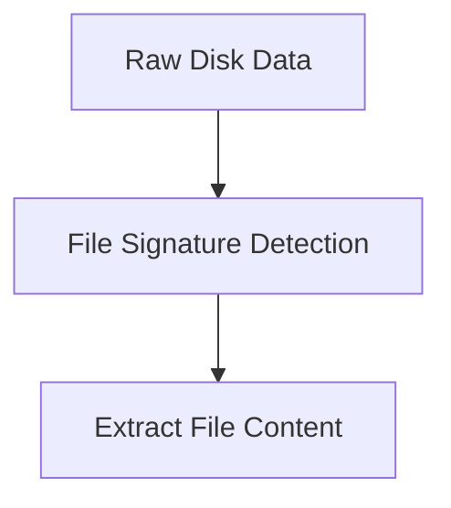

# File Recovery

---

## Why File Recovery Matters

When files are deleted, the data is usually **not immediately erased**.

Instead:

- filesystem metadata changes
- disk space becomes available for reuse
- file data often remains on disk

This behavior allows investigators to recover deleted files.

---

## How File Deletion Works

In most filesystems, deletion follows a similar process:

1. The directory entry is marked as deleted
2. Disk clusters are marked as free
3. The file data remains until overwritten

Because of this, deleted files may remain recoverable.

---

## Recovery Methods

Investigators typically use two recovery approaches:

- filesystem-based recovery
- file carving

Both techniques are commonly used in digital forensics.

---

## Filesystem-Based Recovery

Filesystem-based recovery relies on filesystem metadata.

Examples:

- FAT directory entries
- NTFS MFT records
- cluster chains

If metadata still exists, tools can reconstruct the file structure.

---

## File Carving

File carving is used when filesystem metadata is missing or damaged.

Instead of metadata, carving relies on **file signatures**.

Investigators scan raw disk data to locate recognizable file headers.

---

## File Signature Example

File signatures identify file types in raw disk data.

<div style="display:flex;gap:2rem;align-items:flex-start;margin-top:1rem">

<div style="flex:3">

These bytes appear at the beginning of recognized file types and allow carving tools to locate files even without filesystem metadata.

</div>

<div style="flex:2">

JPEG signature:

```
FFD8FFE0
```

PDF signature:

```
25504446
```

</div>

</div>

---

## File Carving Concept

<div style="display:flex;gap:2rem;align-items:flex-start;margin-top:1rem">

<div style="flex:3">

The tool scans the disk for known file headers and reconstructs files.

This approach works even when filesystem metadata is missing or damaged.

</div>

<div style="flex:2">



</div>

</div>

---

## File Carving Tools

Common file carving tools include:

- scalpel
- foremost
- bulk extractor
- photorec

These tools analyze raw disk data and extract recognizable files.

---

## Example Scalpel Configuration

Scalpel uses configuration files to define file signatures.

<div style="display:flex;gap:2rem;align-items:flex-start;margin-top:1rem">

<div style="flex:3">

This tells Scalpel how to detect JPEG files.

</div>

<div style="flex:2">

```
jpg     y       2000000     \xff\xd8\xff\xe0
```

</div>

</div>

---

## Running Scalpel

<div style="display:flex;gap:2rem;align-items:flex-start;margin-top:1rem">

<div style="flex:3">

The tool scans the disk image and extracts files into the output directory.

</div>

<div style="flex:2">

```
scalpel disk.img -o output_directory
```

</div>

</div>

---

## Limitations of File Carving

File carving is powerful but has limitations:

- fragmented files may not be recoverable
- recovered files may lack filenames
- timestamps are often missing

Because of this, carving is often used as a **last resort**.

---

## Forensic Workflow Example

A typical recovery workflow may look like this:

1. Acquire disk image
2. Identify filesystem
3. Attempt filesystem-based recovery
4. Perform file carving if needed
5. Analyze recovered files

This approach maximizes the chance of recovering useful evidence.

---

## Key Takeaway

Deleted files often remain recoverable.

Investigators can recover files using:

- filesystem metadata
- raw disk analysis
- file signature detection

File recovery is a fundamental capability in digital forensics.
