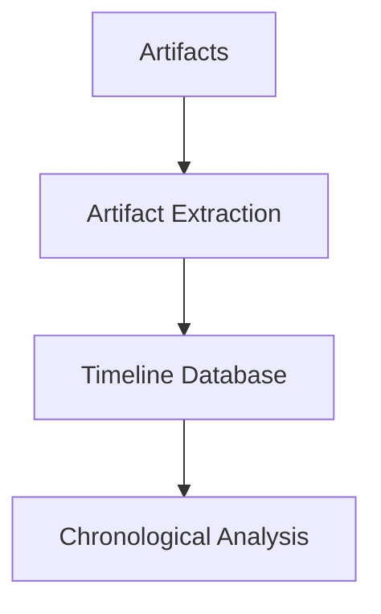

# Timeline Analysis

---

## Why Timeline Analysis Matters

Digital investigations often generate large amounts of data.

Timeline analysis helps investigators:

- organize events chronologically
- understand system activity
- identify suspicious behavior

A timeline turns raw artifacts into a story of what happened.

---

## What Is a Timeline?

A forensic timeline is a chronological list of events extracted from system artifacts.

Example sources include:

- filesystem timestamps
- event logs
- registry artifacts
- application logs

These sources help reconstruct system activity.

---

## Example Timeline

<div style="display:flex;gap:2rem;align-items:flex-start;margin-top:1rem">

<div style="flex:3">

This sequence helps investigators understand the order of events.

</div>

<div style="flex:2">

```
10:01  User downloads file
10:02  File written to disk
10:03  File executed
10:05  Network connection established
```

</div>

</div>

---

## Filesystem Timeline Data

Filesystems store timestamps that are useful for building timelines.

Typical timestamps include:

- Created
- Modified
- Accessed
- Metadata changed

These timestamps are commonly summarized as **MACB**.

---

## MACB Timeline Model

<div style="display:flex;gap:2rem;align-items:flex-start;margin-top:1rem">

<div style="flex:3">

These timestamps provide clues about file activity and help build forensic timelines.

</div>

<div style="flex:2">

```
M  Modified
A  Accessed
C  Metadata Changed
B  Created (Birth)
```

</div>

</div>

---

## Timeline Sources

Timeline data can be extracted from multiple sources:

- filesystem metadata
- system logs
- registry entries
- browser artifacts
- application data

Combining multiple sources produces a more complete timeline.

---

## What Is a Supertimeline?

A **supertimeline** combines artifacts from many sources into a single timeline.

<div style="display:flex;gap:2rem;align-items:flex-start;margin-top:1rem">

<div style="flex:3">

All events are merged into a unified chronological view.

</div>

<div style="flex:2">

```
Filesystem events
System logs
Registry artifacts
Application data
```

</div>

</div>

---

## Supertimeline Concept

<div style="display:flex;gap:2rem;align-items:flex-start;margin-top:1rem">

<div style="flex:3">

This approach helps investigators correlate system activity.

</div>

<div style="flex:2">



</div>

</div>

---

## Creating a Supertimeline

Typical workflow:

1. Acquire disk image
2. Extract artifacts
3. Build timeline database
4. Analyze events chronologically

Tools like **log2timeline** automate this process.

---

## Example Workflow

<div style="display:flex;gap:2rem;align-items:flex-start;margin-top:1rem">

<div style="flex:3">

This produces a timeline investigators can analyze.

</div>

<div style="flex:2">

```
log2timeline.py timeline.plaso disk.img
```

```
psort.py -o l2tcsv timeline.plaso > timeline.csv
```

</div>

</div>

---

## Anti-Forensics: Timestomping

Attackers may attempt to hide activity by manipulating timestamps.

This technique is called **timestomping**.

The goal is to make malicious activity appear older or unrelated to the incident.

---

## Example Timestomping Scenario

<div style="display:flex;gap:2rem;align-items:flex-start;margin-top:1rem">

<div style="flex:3">

Original timeline:

```
10:01 malware.exe created
10:02 malware.exe executed
```

The file appears older than it really is.

</div>

<div style="flex:2">

After timestomping:

```
08:13 malware.exe created
10:02 malware.exe executed
```

</div>

</div>

---

## Timestomping Tools

Attackers can modify timestamps using tools such as:

<div style="display:flex;gap:2rem;align-items:flex-start;margin-top:1rem">

<div style="flex:3">

- PowerShell
- touch
- SetFile (macOS)

This command modifies file timestamps.

</div>

<div style="flex:2">

```
touch -t 201501010101 malware.exe
```

</div>

</div>

---

## Detecting Timestomping

Investigators look for inconsistencies between artifacts.

Examples include:

- MFT timestamps vs `$FILE_NAME`
- filesystem timestamps vs event logs
- file creation time vs execution evidence

When timestamps do not match, manipulation may have occurred.

---

## Correlating Artifacts

Good forensic analysis relies on **correlation**.

Investigators compare:

- filesystem metadata
- event logs
- registry artifacts
- application artifacts

This helps confirm or challenge timeline events.

---

## Key Takeaway

Timeline analysis helps investigators reconstruct system activity.

By combining multiple artifact sources, investigators can:

- understand the sequence of events
- detect suspicious activity
- identify attempts to hide evidence
