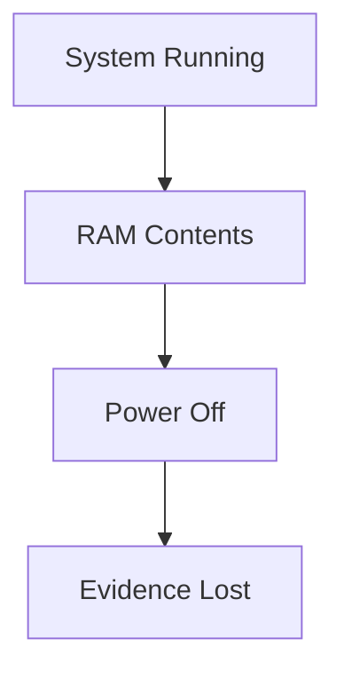
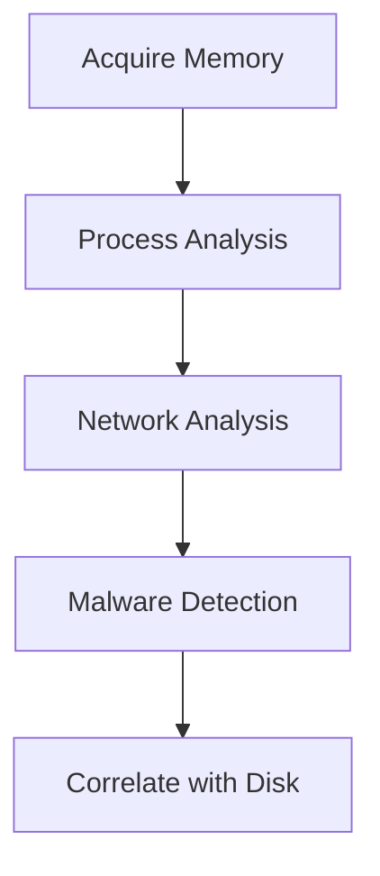

# Memory Forensics

---

## Why Memory Forensics Matters

RAM contains evidence that is never written to disk.

When a system is powered off, this evidence is permanently lost.

<div style="display:flex;gap:2rem;align-items:flex-start;margin-top:1rem">

<div style="flex:3">

Memory can contain:

- running processes and their arguments
- active network connections
- decrypted file contents
- encryption keys and passwords
- malware that lives only in memory

</div>

<div style="flex:2">



</div>

</div>

---

## Volatile vs Non-Volatile Evidence

<div style="display:flex;gap:2rem;align-items:flex-start;margin-top:1rem">

<div style="flex:1">

### Volatile (RAM)

- lost on shutdown
- running processes
- network connections
- decrypted data
- must be acquired first

</div>

<div style="flex:1">

### Non-Volatile (Disk)

- persists after shutdown
- files and filesystem
- logs and registry
- can be acquired later

</div>

</div>

> In live investigations, always acquire memory **before** touching the disk.

---

## Memory Acquisition

Memory must be captured from a **live running system**.

<div style="display:flex;gap:2rem;align-items:flex-start;margin-top:1rem">

<div style="flex:3">

Common acquisition tools:

- **WinPmem** – Windows memory acquisition
- **DumpIt** – Windows, simple single-file tool
- **LiME** – Linux Memory Extractor (kernel module)
- **OSXPmem** – macOS memory acquisition

The result is a raw memory dump file (`.raw`, `.mem`, `.dmp`).

**Virtual machines** are a special case — RAM is already stored as a file on disk:

- VMware → `.vmem`
- VirtualBox → `.sav`
- Hyper-V → `.bin`

For VMs, simply copy the memory file — no acquisition tool needed.

</div>

<div style="flex:2">

```
winpmem.exe memory.raw
```

```
sudo insmod lime.ko
"path=/tmp/memory.raw format=raw"
```

</div>

</div>

---

## Volatility 3

**Volatility** is the leading open-source memory forensics framework.

<div style="display:flex;gap:2rem;align-items:flex-start;margin-top:1rem">

<div style="flex:3">

Version 3 improvements over v2:

- no more manual `--profile` selection
- automatic OS and version detection
- faster analysis engine
- plugins organised by OS: `windows.*`, `linux.*`, `mac.*`

</div>

<div style="flex:2">

Volatility 2 (old):
```
vol.py -f mem.raw --profile=Win10x64 pslist
```

Volatility 3:
```
vol -f mem.raw windows.pslist
```

</div>

</div>

---

## Volatility 3 Basic Syntax

<div style="display:flex;gap:2rem;align-items:flex-start;margin-top:1rem">

<div style="flex:3">

All plugins follow the same pattern:

- `windows.*` – Windows memory analysis
- `linux.*` – Linux memory analysis
- `mac.*` – macOS memory analysis

No profile needed — Volatility detects the OS automatically.

</div>

<div style="flex:2">

```
vol -f memory.raw <plugin>
```

Examples:

```
vol -f memory.raw windows.pslist
vol -f memory.raw windows.netscan
vol -f memory.raw windows.malfind
```

</div>

</div>

---

## Process Analysis

<div style="display:flex;gap:2rem;align-items:flex-start;margin-top:1rem">

<div style="flex:3">

Key process plugins:

- `windows.pslist` – list all running processes
- `windows.pstree` – show parent-child relationships
- `windows.cmdline` – command line arguments for each process

Investigators look for:

- unexpected parent-child relationships
- processes with suspicious names
- processes running from unusual locations

</div>

<div style="flex:2">

```
vol -f memory.raw windows.pslist
```

```
vol -f memory.raw windows.pstree
```

```
vol -f memory.raw windows.cmdline
```

</div>

</div>

---

## Network Connections in Memory

<div style="display:flex;gap:2rem;align-items:flex-start;margin-top:1rem">

<div style="flex:3">

`windows.netscan` reveals active and recently closed network connections.

Investigators look for:

- unexpected outbound connections
- connections to suspicious IP addresses
- unusual ports or protocols
- connections from unexpected processes

</div>

<div style="flex:2">

```
vol -f memory.raw windows.netscan
```

Example output fields:

```
Offset   Proto  LocalAddr  ForeignAddr  State   PID  Process
```

</div>

</div>

---

## Finding Malware with malfind

<div style="display:flex;gap:2rem;align-items:flex-start;margin-top:1rem">

<div style="flex:3">

`windows.malfind` detects memory regions that may contain injected code.

It looks for:

- executable memory regions not backed by a file on disk
- regions with suspicious permissions (read, write, execute)
- common shellcode patterns

Results should be reviewed and may require further analysis.

</div>

<div style="flex:2">

```
vol -f memory.raw windows.malfind
```

```
vol -f memory.raw windows.dlllist
```

</div>

</div>

---

## Useful Volatility 3 Plugins

| Plugin | Purpose |
|--------|---------|
| `windows.pslist` | List running processes |
| `windows.pstree` | Process hierarchy |
| `windows.cmdline` | Process command lines |
| `windows.netscan` | Network connections |
| `windows.malfind` | Suspicious memory regions |
| `windows.dlllist` | Loaded DLLs per process |
| `windows.filescan` | File objects in memory |
| `windows.hashdump` | Extract password hashes |

---

## Memory Forensics Workflow

<div style="display:flex;gap:2rem;align-items:flex-start;margin-top:1rem">

<div style="flex:3">

Typical memory analysis steps:

1. Acquire memory image from live system
2. Verify image integrity (hash)
3. List and review running processes
4. Inspect process command lines
5. Identify active network connections
6. Look for injected code or anomalies
7. Correlate findings with disk artifacts

</div>

<div style="flex:2">



</div>

</div>

---

## Key Takeaway

Memory forensics reveals evidence that is invisible on disk.

Investigators can find:

- malware that never touches the disk
- active attacker tools and connections
- decrypted credentials and keys
- the full picture of what was running at the time of acquisition
